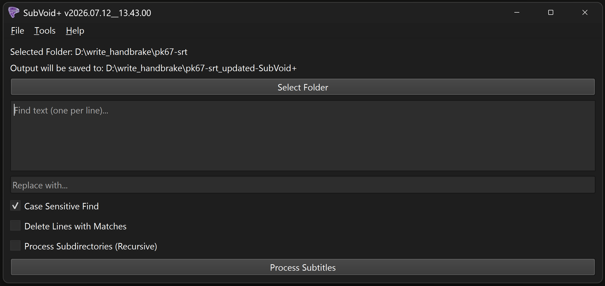

#  SUBVOID+™ 
**A specialized utility for stripping advertisements, recruitment spam, and social media tags from subtitle files.**

---

## Overview
SubVoid+™ is a high-performance subtitle cleanup tool designed to sanitize media libraries by removing intrusive on-screen text. It surgically identifies and purges common fansub recruitment blocks, cryptographic donation addresses, and advertisement URLs from **.srt**, **.ass**, and **.ssa** files while maintaining the original timing and file structure.

**Primary Environment:** Developed and tested on **Python 3.14.5** using the **PyQt6** framework. It is intended for users who prioritize clean, distraction-free viewing experiences and require a batch-processing solution for subtitle management.

### The Cleaning Engine
The utility utilizes a context-aware parsing engine that adapts its logic based on the subtitle container format.

Key operational features include:
1. **SRT Block-Level Awareness:** Unlike standard line-by-line editors, SubVoid+™ analyzes SRT files as logical blocks. If an advertisement is detected within a multi-line subtitle, the entire block—including safe lines—is purged to prevent "ghost" subtitles from remaining on-screen.
2. **Surgical ASS/SSA Payload Targeting:** For Advanced Substation Alpha files, the engine targets the payload field within `Dialogue` and `Comment` lines. This ensures that ad-removal never breaks complex style tags, override codes, or event metadata.
3. **Automated Filter Pipeline:** Includes pre-compiled regex patterns for:
    * **Ads:** Detects common URL structures (`.com`, `.net`, etc.).
    * **Recruiters:** Identifies fansub crew recruitment phrases (e.g., "we need translators").
    * **Spam:** Strips Ethereum/Bitcoin wallet addresses and email contact info.
4. **Recursive Folder Mirroring:** When the recursive option is enabled, the utility scans all nested subdirectories. To maintain organization, it recreates the original directory hierarchy within the output folder.
5. **Non-Destructive Output:** Operates with a safety-first philosophy. Original files are never modified; processed subtitles are saved to a dedicated `_updated-SubVoid+` directory to ensure data integrity.

---

## Feature Reference

| Option | Description |
| :--- | :--- |
| **Case Sensitive Find** | Enforces strict character case matching during search operations. |
| **Delete Lines with Matches** | Completely strips the entire text payload from a line if any user-defined search term matches it. |
| **Process Subdirectories (Recursive)** | Scans all folders within the target directory and mirrors the source structure in the output location. |
| **Recruitment Filter** | Detects and removes multi-line fansub crew recruitment blocks and introductory promotional phrases. |
| **Spam Filter** | Strips cryptographic wallet addresses, credit card number groups, and payment keywords. |
| **Theme Engine** | Supports Dark, Light, and System-synced UI modes via a custom QPalette implementation. |

---

## Assets & Licensing
This software is released under the **GNU General Public License v3**.

### Icon Credits
* **File:** `SubVoid+-vortex-indigo-icon.svg`
    * **Asset:** Tornado SVG Vector
    * **Author:** JoyPixels
    * **Source:** <a href="https://www.svgrepo.com/svg/402817/tornado" target="_blank">https://www.svgrepo.com/svg/402817/tornado</a>
    * **License:** <a href="https://git.disroot.org/pwshAgyjkcrg761/SubVoid-plus/src/branch/main/SubVoid+_internal/SubVoid+_icon/LICENSE" target="_blank">MIT License</a>
    * **Modifications:** Color-adjusted to Indigo and optimized for SubVoid+™ branding.

---

## Dependencies
* **OS:** Microsoft Windows 10 / 11.
* **Python:** 3.14.5+ (Recommended).
* **PyQt6:** Required for the Graphical User Interface.

## Support & Maintenance
**This repository is provided "as-is" for archival purposes.** The author is not actively looking for feedback, feature requests, or bug reports. The issue tracker is disabled.

## Disclaimer
*SubVoid+™ is a tool for subtitle metadata management. The author is not responsible for the content of the files processed or any legal implications arising from the modification of third-party subtitle data. Use this utility responsibly and in accordance with local copyright regulations.*

---
> **Document Control** 
> *This document is up-to-date with the following version of SubVoid+™.* 
> *2026.07.12__13.43.00*